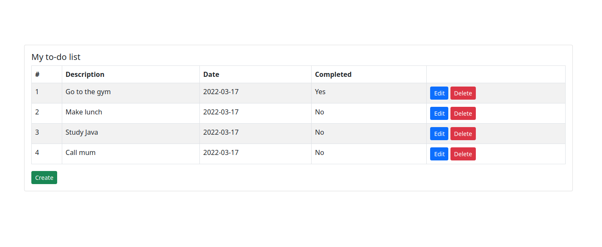
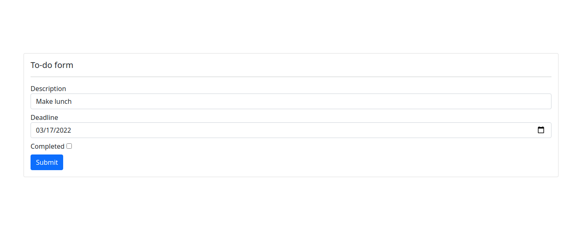

# To-do list

The project implements a simple to-do list written in Java. The user can add new items to their to-do list, edit existing ones or delete them.

Technologies used:
- Spring Boot
- MySQL
- Thymeleaf

## How to launch the application

1. Make sure you have Java JDK installed.
2. Clone the code: https://github.com/georgia-koukoutou/to-do-list.git
3. Open the application directory with `cd to-do-list`
4. Compile the application with `mvn clean package`
4. Run the application using `java -jar target/todolist.jar `
5. Open http://localhost:8080
6. Enjoy the application!

## Application demo

Homepage: 

Create new item:

Edit item:

